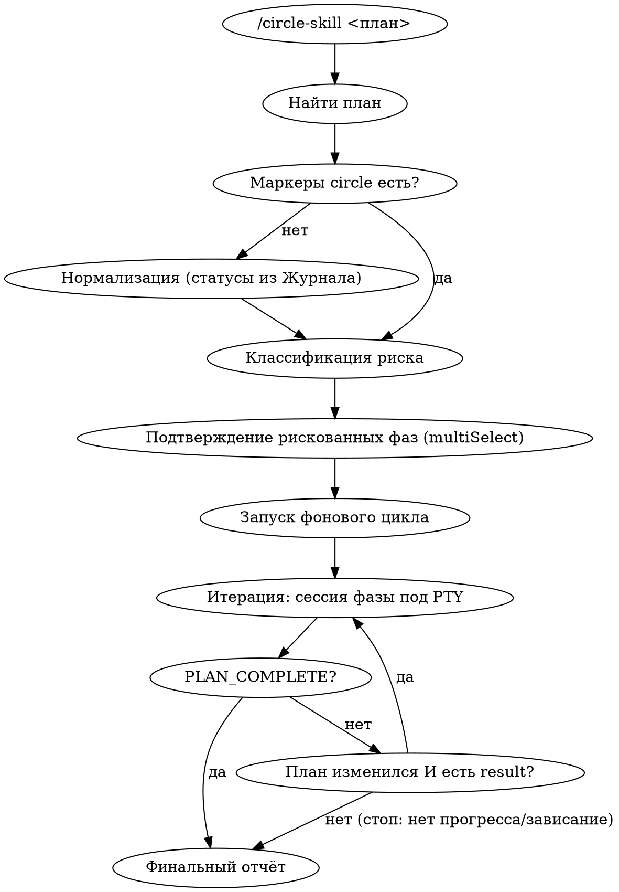

# Дизайн: плагин `circle-skill`

Дата: 2026-06-03. Статус: согласовано (готов к написанию плана реализации).

## Назначение

Плагин для Claude Code, автономно исполняющий заранее проработанный **фазовый план**
по одной фазе за отдельную сессию, в цикле, до полного выполнения плана либо до остановки
по отсутствию прогресса. Цель — выполнять согласованный план в отдельных свежих сессиях, держа
контекстное окно каждой сессии в комфортном для эффективной работы размере.

## Ключевые ограничения (заданы владельцем)

1. **Только подписка, не API.** Запуск `claude -p` (headless/print) тарифицируется как программное
   использование (API). Поэтому фазовые сессии — **настоящие интерактивные** сессии `claude` под
   PTY (тот же OAuth, что и обычная работа; `ANTHROPIC_API_KEY` в окружении не задействуется).
2. **Полноценные сессии.** Фазовая сессия должна видеть установленные плагины и уметь спавнить
   субагентов. Это исключает «фаза = субагент» (субагент не спавнит субагентов) и headless-режим.
3. **Человек в цикле для рискованного.** Необратимые / прод- / требующие человека фазы не должны
   выполняться автономно без явного подтверждения владельца.
4. **Останавливаться по отсутствию прогресса.** Если после сессии план не изменился — стоп и отчёт.
   Отдельного лимита числа итераций нет (только детектор зависания по таймауту).
5. **Портируемость.** Плагин ставится на любую машину (macOS/Linux; Windows — через WSL), без
   жёсткой зависимости от конкретной утилиты данной машины.

## Архитектура: «умный препролёт + детерминированный цикл»

- **Препролёт** — в текущей интерактивной сессии, с участием Клода и владельца: находит план,
  нормализует формат, классифицирует фазы по риску, спрашивает подтверждение, запускает цикл.
  Здесь нужны интеллект и взаимодействие.
- **Цикл** — фоновый детерминированный bash-скрипт: запускает по одной интерактивной сессии на
  фазу под PTY, ждёт файл-результат, сравнивает хеш плана, повторяет. «Клода в цикле» нет —
  ноль лишних токенов на саму оркестрацию.



## Формат плана

Markdown, три слоя:

1. **Прозаические секции** (контекст, стратегия, риски, документация) — плагин их не парсит; они для
   Клода-исполнителя и человека. Совместимо с уже существующими планами владельца.
2. **Фазы** — секции `## Фаза <id> — <title>`, под каждым заголовком компактный машиночитаемый
   маркер в HTML-комментарии (невидим в рендере):
   ```
   ## Фаза 2 — Перенос исторической активности
   <!-- circle: status=pending order=20 deps=[1] autonomy=auto obstacle="" -->
   ```
   Поля:
   - `status` — `pending | in_progress | done | blocked | skipped`.
   - `order` — целое; сортировка выбора фаз. Исполнитель вправе менять.
   - `deps` — список id фаз-предшественников (должны быть `done`, иначе фаза не берётся).
   - `autonomy` — `auto | needs-human`. Только `auto`-фазы исполняются циклом.
   - `obstacle` — строка-причина для `blocked` (пусто иначе).
     Маркер — единственный источник истины по статусу; живёт рядом со своей фазой (а не в отдельном
     реестре наверху файла, чтобы исключить рассинхрон реестра и секций).
3. **Журнал** — append-only секция (5–8 строк на сессию): человекочитаемая история и вторичный
   признак прогресса. Исполнитель обязан дописывать запись последним шагом каждой сессии.

## Нормализация существующих планов

Планы владельца ещё не размечены маркерами `circle`. При первом запуске на «сыром» плане препролёт:

1. Извлекает список фаз из заголовков `## Фаза …`.
2. **Выводит статусы из Журнала** (например: фазы, помеченные в журнале как задеплоенные/исполненные,
   = `done`; остальные = `pending`).
3. Проставляет `order` (по порядку в файле) и эвристически `deps` / `autonomy` (см. ниже).
4. Показывает владельцу получившуюся разметку, по подтверждению вписывает маркеры в файл плана.

## Препролёт безопасности (человек в цикле)

Перед стартом цикла Клод-классификатор размечает каждую фазу `auto` либо `needs-human`, опираясь и на
явное поле `autonomy`, и на семантику (сигналы: `DROP`, `деплой`/`deploy`, «прод», `SSH`, «бэкап»,
«владелец», «СТОП-точка», «необратимо», и т. п.). Затем:

- Показывает владельцу **список** фаз, требующих человека / несущих необратимый прод-риск.
- Спрашивает (мульти-выбор): какие из них разрешить выполнять **автономно без него**.
- Разрешённые → `autonomy=auto` (участвуют в цикле). Неразрешённые → `status=skipped` (цикл их не
  берёт; зависящие от них фазы естественно станут невыбираемыми и попадут в отчёт как невыполненные).

## Механизм исполнения фазовой сессии

Каждая фаза = свежая интерактивная сессия `claude` под псевдо-терминалом (PTY):

- Запуск: `claude --dangerously-skip-permissions "<короткий стартовый prompt>"` в директории проекта.
  `--dangerously-skip-permissions` обязателен: иначе интерактивная сессия зависнет на запросе
  разрешения и автономии не будет (именно поэтому препролёт-подтверждение рискованных фаз критично).
- Под PTY — потому что интерактивный TUI требует терминал. PTY-драйвер: **python3 (только stdlib
  `pty`)**, как самый портируемый zero-install вариант; `expect`/`script` — опциональный фоллбэк;
  при отсутствии всех — внятная ошибка с подсказкой по установке.
- **Сигналинг — через файлы, не скрейпингом TUI** (парсить ANSI-вывод ненадёжно):
  - Стартовый prompt краткий: «прочитай и выполни инструкцию из `.circle/executor-prompt.md`».
  - Последний обязательный шаг исполнителя — записать `.circle/result`:
    первая строка `CIRCLE_RESULT: PHASE_DONE` либо `CIRCLE_RESULT: PLAN_COMPLETE`, далее — резюме.
  - Цикл поллит появление `.circle/result`, затем убивает сессию.

### Промпт фазы-исполнителя (`.circle/executor-prompt.md`)

Инструкция каждой сессии:

1. Прочитать план по пути `$CIRCLE_PLAN`. Выбрать **первую подходящую** фазу: `status=pending`,
   все `deps` в `done`, `autonomy=auto`, не `skipped`, минимальный `order`.
   `in_progress`-фаза = недоделанный остаток прошлой сессии → доделать либо откатить.
2. Выполнить фазу. Доступны все инструменты (Bash/SSH/БД и т. д.) и субагенты.
3. **Успех** → `status=done`, запись в Журнал, `.circle/result` = `PHASE_DONE`.
4. **Неуспех** → откат своих изменений (git reset, либо best-effort для не-git: удалённый сервер/БД;
   необратимое — зафиксировать в obstacle), `status=blocked` + `obstacle="…"`, запись в Журнал,
   `.circle/result` = `PHASE_DONE`.
5. **Нет подходящих фаз** → `.circle/result` = `PLAN_COMPLETE` + перечень невыполненных
   (`blocked`/`skipped`) фаз с причинами.
6. Исполнитель вправе менять `order`, дробить фазу на подфазы, корректировать статусы.

## Цикл и условия остановки

```bash
unset ANTHROPIC_API_KEY                 # гарантия: только подписка, не API
acquire .circle/lock                    # один цикл на план
loop:
  rm -f .circle/result
  H1 = sha256(plan)
  run-phase под PTY: claude --dangerously-skip-permissions "выполни .circle/executor-prompt.md"
  ждать .circle/result  (поллинг; таймаут = детектор зависания)
  kill сессии
  read result
  if result startswith "CIRCLE_RESULT: PLAN_COMPLETE":  стоп → финальный отчёт
  if result отсутствует/таймаут  OR  sha256(plan) == H1: стоп (нет прогресса/зависание) → отчёт
  else: следующая итерация
release lock
```

- **Главный предохранитель (заданный владельцем):** план не изменился ⇒ стоп. Отдельного лимита
  итераций нет.
- **Таймаут** — не лимит итераций, а детектор зависания (сессия ждёт ввода / упёрлась в лимит /
  крутится). Срок щедрый и настраиваемый (фазы с прогоном тестов и деплоем идут долго).
- **Фоновый запуск** — через background-bash харнесса: переживает ходы, по завершении заново будит
  основную сессию, и Клод выдаёт владельцу финальный отчёт. Прогресс по ходу — в лог-файле плагина.

## Структура плагина

```
circle-skill/
  .claude-plugin/plugin.json
  commands/circle-skill.md      # /circle-skill <план> — препролёт + запуск цикла
  scripts/circle-loop.sh        # детерминированный фоновый цикл
  scripts/run-phase.py          # PTY-раннер (python3 stdlib); ждёт .circle/result, убивает сессию
  scripts/executor-prompt.md    # шаблон промпта фазы-исполнителя
  README.md
```

Рабочая директория `.circle/` создаётся рядом с планом (или в корне проекта): `result`, `lock`,
`loop.log`, метаданные текущей итерации. Добавить в `.gitignore` проекта-цели.

## Финальный отчёт

По остановке цикла Клод (разбуженный завершением фонового процесса) выдаёт владельцу:
итог (план выполнен полностью / остановлен по отсутствию прогресса / зависание) + перечень
невыполненных фаз (`blocked` с obstacle, `skipped`) с причинами. Источники — маркеры фаз + Журнал +
`.circle/result`.

## Edge-cases (заложить в реализацию)

- **Сессия сделала внешнее изменение, но забыла обновить план** → ложный «стоп по неизменности».
  Митигация: запись в Журнал — обязательный последний шаг исполнителя всегда.
- **Сессия упала/уперлась в контекст на середине фазы** → план обновлён частично (`in_progress`);
  хеш изменился, цикл идёт дальше; следующая сессия видит `in_progress` и доделывает либо откатывает.
- **Циклические/неудовлетворимые `deps`** → нет подходящих фаз, но не всё `done` → `PLAN_COMPLETE`
  с перечнем `blocked`.
- **Необратимая фаза, подтверждённая на авто, падает на середине** → фиксируется obstacle; частичный
  необратимый ущерб неизбежен — единственная защита здесь и есть препролёт-подтверждение.
- **Зависшая сессия (ждёт ввода / лимит / бесконечный цикл)** → `.circle/result` не появляется →
  таймаут убивает сессию → цикл трактует как «нет прогресса» → стоп + отчёт.
- **Параллельный запуск на том же плане** → `.circle/lock`.
- **`claude`/`python3` не найдены** → препролёт проверяет наличие до старта цикла, внятная ошибка.
- **План не найден / путь с пробелами** → препролёт валидирует и сообщает.

## Отвергнутые альтернативы

- **`claude -p` (headless):** тарифицируется как API — нарушает ограничение 1.
- **Фаза = субагент (Agent/Task/Workflow):** субагент не спавнит субагентов и не даёт «полноценную
  сессию с плагинами» — нарушает ограничение 2.
- **Единый YAML-реестр фаз наверху файла:** неизбежно расходится с секциями фаз; маркер-у-фазы
  устраняет рассинхрон.
- **Парсинг русских «готово»/«план выполнен полностью» из вывода TUI:** ненадёжно (ANSI, свободный
  текст); файл-сентинел `.circle/result` надёжнее.
- **`expect`/tmux как жёсткая зависимость:** не гарантированы на чужой машине; python3-stdlib `pty`
  портируемее (фоллбэк на `expect`/`script` оставлен опционально).
- **`node-pty`:** нативные платформенные бинари — против портируемости.
- **Жёсткий лимит итераций:** владелец задал критерий остановки = неизменность плана; лимит не нужен.
